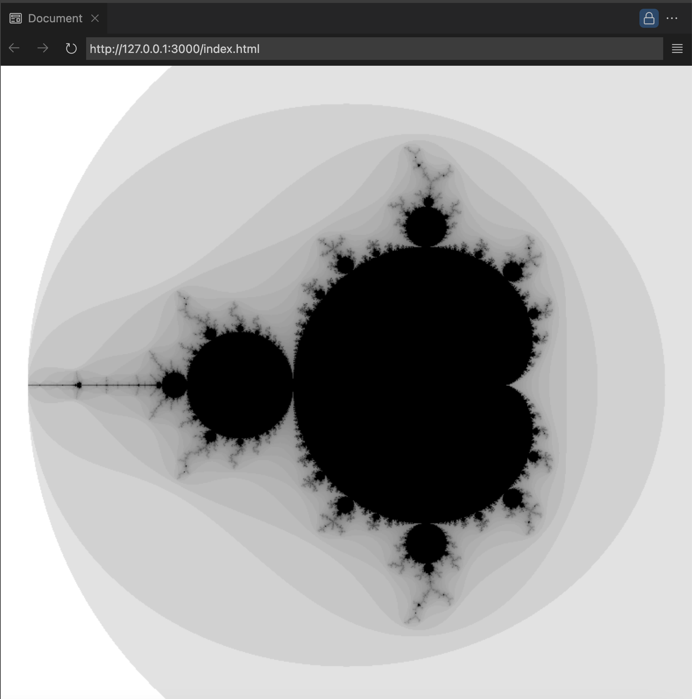

# Mandelbrot Set Generator

This project is an interactive visualization of the Mandelbrot set using JavaScript and Web Workers for parallel processing. The code is from the book "JavaScript: The Definitive Guide".

## Description

The program divides the viewing area into multiple "tiles" and uses a `WorkerPool` to distribute the task of calculating each tile among several workers (`Web Workers`). This allows for faster and more efficient processing by leveraging multiple CPU cores.

## Features

- **Interactivity**: You can zoom and pan through the Mandelbrot set using the mouse and keyboard.
- **Parallel Processing**: Utilizes Web Workers to compute Mandelbrot values in parallel.
- **Dynamic Adjustment**: Automatically adjusts resolution and iteration count to provide a detailed visualization.

## Controls

- **Arrow keys**: Pan through the image.
- **"+" key**: Increase the number of iterations.
- **"-" key**: Decrease the number of iterations.
- **"o" key**: Increase pixel size (zoom out).
- **"Escape" key**: Reset to the initial view.

## Example

## Project Structure

- `index.html`: Main HTML file that loads the JavaScript script.
- `mandelbrot.js`: Contains all the logic for generating and visualizing the Mandelbrot set.

## Installation and Usage

1. Clone this repository.
2. Open `index.html` in your web browser.
3. Interact with the visualization using the mentioned controls.

## Credits

This project was developed to demonstrate the use of Web Workers in fractal visualization. The code is from the book "JavaScript: The Definitive Guide".